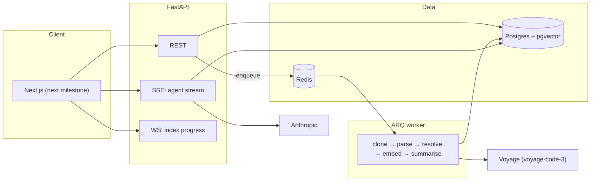

# CodeScout

**Ask questions about an unfamiliar codebase and get answers with real file-and-line citations.**

Point it at a GitHub repository. It parses the code into a symbol graph, then an
agent investigates your question using the same primitives a human would — grep,
file reading, symbol lookup, reference lookup, call-graph traversal, and semantic
search — and answers with citations you can click.

> **Status:** backend complete and tested (99 tests, 76% coverage). Frontend is
> the next milestone. See [Roadmap](#roadmap).

---

## Why this is not another "chat with your PDF"

Most retrieval-augmented demos do one thing: embed everything, take the top *k*
chunks for a query, paste them into a prompt. That fails on code in a specific,
predictable way.

Ask *"where does authentication happen?"* of a naive RAG system and it returns
the five chunks whose embeddings sit nearest the word "authentication" — usually
a config constant, a test, a docstring, and half of a function whose other half
got cut off at the chunk boundary. It cannot follow a call. It cannot check who
uses a symbol. It cannot open the file it just found and read the surrounding
twenty lines.

CodeScout gives the model tools instead of a context stuffing:

```
Q: "What happens to a request carrying an expired token?"

  → find_symbol("verify_token")           12ms   1 definition
  → read_file("app/auth/tokens.py", 28)   4ms    lines 28-50
  → find_references("verify_token")       18ms   1 call site
  → read_file("app/auth/middleware.py")   6ms    lines 24-45

A: extract_bearer pulls the token off the Authorization header
   [app/auth/middleware.py:47-54]. verify_token recomputes the HMAC, compares it
   in constant time, then checks the exp claim and raises ExpiredToken
   [app/auth/tokens.py:31-48]. The middleware catches that specific exception and
   returns 401 "token expired" [app/auth/middleware.py:33-35].
```

Four targeted lookups instead of one fuzzy one. The answer traces actual control
flow because the agent actually followed it.

Three design choices make this work:

1. **Chunks never split a symbol.** Chunking happens on tree-sitter symbol
   boundaries, so a retrieved chunk is a whole function or a whole markdown
   section — never the second half of one function glued to the first half of
   the next.
2. **The graph is a first-class index, not an afterthought.** Call, import and
   inheritance edges are resolved at ingest time, so `find_references` and
   `get_call_graph` are database queries rather than another fuzzy search.
3. **Citations are validated before they reach you.** Every `path:start-end` the
   model produces is checked against the index; ones that do not resolve are
   dropped and counted. The drop rate is a tracked metric, not a hope.

---

## Architecture



### The immutable index run

The design decision everything else hangs off: **an index run is an immutable
snapshot pinned to a commit SHA.** Files, symbols, edges and chunks all belong to
a run, never to a repository directly, and every answer records which run
produced it.

That buys three things:

- A citation can never drift onto a line that has since moved.
- Re-indexing is cheap: unchanged content is recognised by hash and never
  re-embedded ([`embed.py`](backend/app/ingest/embed.py)).
- A failed ingest leaves the previous run intact and queryable, rather than a
  half-updated index.

---

## Quick start

```bash
git clone <your-fork> codescout && cd codescout
cp .env.example .env          # works as-is: providers default to offline fakes
make up                       # Postgres + Redis + API + worker
make migrate
make test                     # 99 tests, no API key needed
```

The whole stack runs offline. `LLM_PROVIDER=fake` and `EMBEDDING_PROVIDER=fake`
swap in a scripted model and a hashed bag-of-words embedder — a weak embedding
model, but a real one, so retrieval tests assert behaviour rather than asserting
that a mock was called.

To run it for real, set `ANTHROPIC_API_KEY` and `VOYAGE_API_KEY` in `.env` and
flip both providers.

### Without Docker

```bash
make venv
createdb codescout && psql codescout -c 'CREATE EXTENSION vector; CREATE EXTENSION pg_trgm;'
make migrate && make api      # and `make worker` in another shell
```

---

## The eight tools

| Tool | What it answers |
|---|---|
| `get_repo_overview` | "What is this project?" — cached, costs no tool call at runtime |
| `list_directory` | "What is the shape of this tree?" |
| `read_file` | "Show me lines 28-60" — line-numbered, so citations are exact |
| `grep` | "Where is the literal string `X-Request-ID`?" |
| `semantic_search` | "Where is retry logic?" — when you know the *what*, not the *name* |
| `find_symbol` | "Where is `verify_token` defined?" |
| `find_references` | "What breaks if I change this?" |
| `get_call_graph` | "What does this end up calling, two levels down?" |

Two invariants across all of them: output carries real paths and 1-based line
numbers, and output is bounded and says explicitly when it was truncated — so
the model can tell "no more results" from "more results not shown."

The agent gets a hard budget of 12 tool calls. On exhaustion it answers with what
it has and says the investigation was cut short, rather than trailing off.

### On the hand-rolled agent loop

[`app/agent/loop.py`](backend/app/agent/loop.py) is ~200 lines and uses no agent
framework. That is deliberate: the tool budget, the citation validation and the
event stream are the interesting parts of this project, and burying them inside
a framework's abstractions would make them both harder to reason about and
harder to test. The `LLMProvider` protocol is four methods, which is what makes
the scripted test double possible.

---

## Evals

The part most portfolio projects skip.

`backend/evals/cases.yaml` holds cases pinned to exact commits (pinning is
mandatory — otherwise your baseline drifts under you and upstream refactoring
looks like a regression). Each case is tagged:

- `locate` — "where is X implemented?"
- `explain` — "how does Y work end to end?"
- `impact` — "what breaks if I change Z?"
- `absent` — **the repository does not do this**, and the correct answer is to
  say so

Those `absent` cases are the ones worth arguing for in an interview. A model that
wants to be helpful will invent a plausible rate-limiting mechanism rather than
say "there isn't one," and nothing else in a normal eval suite catches it.

### Metrics

Retrieval quality and answer quality are measured **separately**, because when an
answer is wrong you need to know whether the agent failed to *find* the code or
failed to *reason* about it:

| Metric | Meaning |
|---|---|
| `file_recall` | Fraction of expected files that appear in citations |
| `citation_validity` | Fraction of emitted citations that resolve to real lines |
| `abstention_accuracy` | Said "it doesn't" exactly when it should have |
| `mean_score` | LLM judge against the case rubric, 1-5 |
| `p50/p95 latency`, `cost_usd`, `tool_calls` | The operational side |

```bash
make eval              # full suite
make eval-baseline     # record current scores as the baseline
make eval-smoke        # 15-case CI subset with the regression gate
```

`--fail-on-regression` exits non-zero when mean score drops more than 0.3 or file
recall drops more than 5 points against the stored baseline. That is what makes
this a CI gate rather than a dashboard: a prompt edit that degrades quality
fails the PR.

### On trusting the judge

An LLM judge is a measurement instrument, and an uncalibrated instrument is worse
than no instrument because it produces confident numbers. Two mitigations are
built in: the judge runs on a **different model** than the one under test, and
`agreement_rate()` compares judge scores against hand labels. Label ~20 cases
yourself and put the exact and within-one agreement in this README before quoting
any score as meaningful.

---

## Security

A cloned repository is untrusted input, and a GitHub token is a credential for
someone else's private code.

- Tokens are Fernet-encrypted at rest, never logged, never serialised to the client.
- Every repo-scoped query filters on `repo_access`, and missing access returns
  **404, not 403**, so the API never confirms that a private repository exists.
  Three tests in [`test_api.py`](backend/tests/test_api.py) assert this
  explicitly and must never regress.
- `git` runs with hooks and credential helpers disabled, no shell interpolation,
  and symlinks that escape the clone directory are rejected.
- The container runs as a non-root user.
- **Prompt injection:** file contents are data, not instructions. A repository
  can contain a README that tries to instruct the model. Tool output is delimited
  and the system prompt says so. This is mitigation, not a solution — it is an
  honest open problem and a good thing to be asked about.

---

## Project layout

```
backend/
  app/
    agent/        loop.py, tools.py, schemas.py, prompts/answer_v1.md
    api/          auth, repos, conversations (SSE), files (WS)
    ingest/       clone → walk → parse → chunk → embed → overview → pipeline
    evals/        runner, judge, metrics
    providers/    protocol + anthropic, voyage, and deterministic fakes
    models.py     the full schema
  alembic/        migrations
  evals/          cases.yaml
  tests/          99 tests + a fixture repository
```

~5,200 lines of application code, ~1,300 lines of tests.

---

## Test suite

```
tests/test_ingest.py   16   walk, parse (py/ts/go), chunking, pipeline, cache reuse
tests/test_tools.py    25   every tool, against a real indexed fixture repo
tests/test_agent.py    17   budget, citation validation, event order, failure containment
tests/test_api.py      17   auth, access control, SSE streaming, persistence
tests/test_evals.py    24   metrics maths, the regression gate, judge parsing
```

Everything runs against a real Postgres with pgvector — no mocked database. The
only test doubles are the two provider protocols.

Two bugs the suite caught during development, both worth knowing about:

1. **The loop could execute a 13th tool call on a 12-call budget.** Passing
   `tools=None` should stop a provider returning tool calls, but nothing
   *enforced* it. Now the loop treats the post-budget turn as final regardless of
   what comes back.
2. **The embedding cache is global by `(content_hash, model)`**, so a second
   ingest of identical content embeds nothing — which made a naive "first run
   embeds > 0" assertion fail once another test had warmed the cache. Correct
   behaviour, surprising test.

---

## Roadmap

Done:

- [x] Ingestion pipeline: clone, walk, tree-sitter parse (Python/TS/JS/Go), edge
      resolution, symbol-boundary chunking, embedding with content-hash dedupe
- [x] Symbol graph with resolved call/import/inheritance edges
- [x] Eight agent tools over the graph
- [x] Agent loop with tool budget, citation validation, SSE event stream
- [x] REST + SSE + WebSocket API, GitHub OAuth, rate limiting
- [x] Eval harness with LLM judge, metrics and a CI regression gate

Next:

- [ ] Next.js frontend: chat, live agent trace, citation panel with file viewer
- [ ] Pre-indexed public demo repo (no login needed to try it)
- [ ] Architecture diagram generation and onboarding-doc export
- [ ] OpenTelemetry traces + Langfuse, and an in-app cost dashboard
- [ ] Hybrid retrieval (BM25 + vectors) **with an ablation in the evals**

---

## What I would do differently

- **Full file text lives in Postgres.** Simple, snapshot-consistent, and fine at
  this scale, but a 50k-file monorepo will make that table large. Object storage
  with a content-hash key is the real answer.
- **Edge resolution is name-based, not type-aware.** An ambiguous bare name stays
  deliberately unresolved rather than guessing — a wrong edge is worse than a
  missing one when the agent is walking a call graph — but that means dynamic
  dispatch and re-exports are invisible. Proper scope resolution per language is
  a large piece of work I chose not to start.
- **Answer streaming is sentence-chunked, not token-level.** The tool-call
  events stream live, which is the part that matters for perceived latency, but
  real token streaming means threading the provider's streaming API through the
  tool loop. Deferred on purpose, not overlooked.
- **The `absent` eval cases rely on keyword-based abstention detection**, which
  will misfire on an answer phrased unusually. The LLM judge is the real signal;
  the keyword check is a cheap cross-check.

---

## License

MIT
